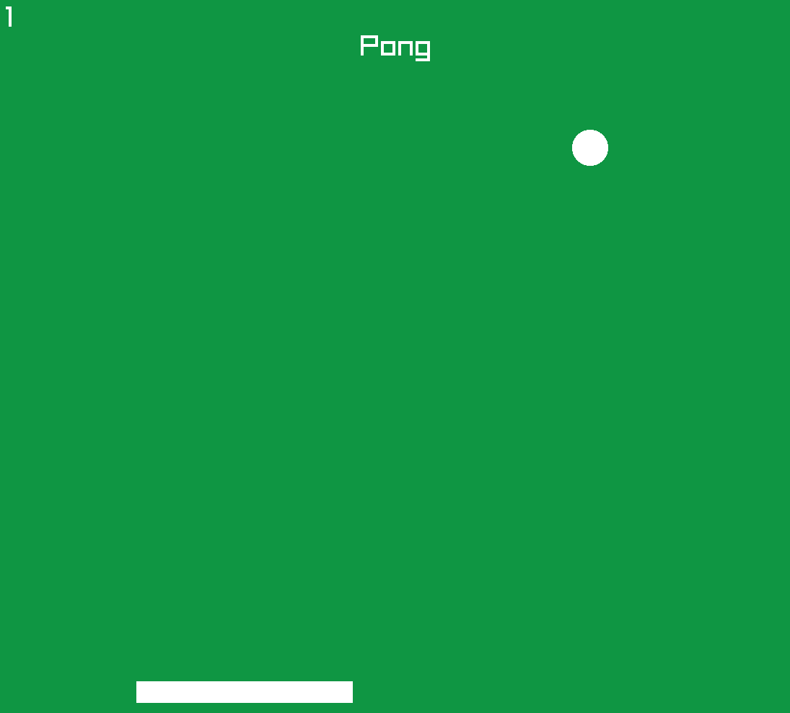

# Single Player Pong in C++

## Observation and License:
This project was made using a template developed by "Programming with Nick" on YouTube. You can find it <a href="https://github.com/educ8s/Raylib-CPP-Starter-Template-for-VSCODE-V2" target="_blank"> here.</a> (I also recommend watching his video explaining how to use this template, you can find it <a href="https://www.youtube.com/watch?v=acvgbKRaxDI" target="_blank">here</a>).

The original template and its respective archives remain under the rights of their auctor's. The modifications and the additional code were developed by me.

This project is licensed under the [MIT License](LICENSE), except for the
original template code used as its foundation.

The original template code is not covered by this license and
remains under the copyright of its respective authors.

## Description:
I created this game specially to measure my knowledge about Raylib (the library used in this project), since I'm currently a beginner in the game making area.
Be known that this game might have some flaws in it's gameplay, and if you want, you can tell me about any flaw you find in this project.

This awesome game consists of a ball that bounces through the edges of the window and a movable pad controlled by the player that can deflect the ball.

You can control the pad by pressing the "A" or "<-" keys to go left, and "D" or "->" to go right. Your mission as the pad is to not let ball hit the bottom of the window. The score in the top-left increases when the ball is succesfully deflected. If you lose, press "ENTER" to restart the game.

This game is also a great way to spend time, and if you're a starter in Raylib, you can analyse the game code and try to redo it yourself, learning some of this library fundamentals.



## How to run:
Firstly, you'll need to have the Raylib library already installed, since the whole game structure is based around it.

The installer for this library is available at the creator's website: <a href="https://www.raylib.com/" target="_blank" >raylib.com </a>

Then, you'll need these two requirements:
<ul>
<li> C/C++ running extension on VSCode.</li>
<li> A C++ running compiler, like MinGW (Windows), GCC (Linux) or Clang (Linux/macOS).
</ul>

If you have already met all these requirements, you can run the code by pressing F5 in VSCode (The project is configured to build and launch the game through VSCode's debugging configuration. Therefore, the game should be
started using F5 rather than the Run button in the top-right corner).

## Structure:
```
Pong-Raylib/
├── .vscode/   /* VSCode configuration for it to run (from the template)*/
│   ├── .gitkeep
│   ├── c_cpp_properties.json
│   ├── launch.json
│   ├── settings.json
│   └── tasks.json
├── assets/   /* Images used */
│   └── game-footage.png
├── lib/      /* Compiler configuration (from the template)
│   ├── libgcc_s_dw2-1.dll
│   └── libstdc++-6.dll
├── src/     /* Game code */
│  └── main.cpp
├── .gitattributes         /* Git running configurations
├── .gitignore              (from the template) */
├── LICENSE            /* LICENSE */
├── main.code-workspace    /* Workspace and Makefile 
├── Makefile               configurations  (from the template) */
└── README.md   /* README */

```


